> *"O Captain! My Captain! The fearful trip is done, The ship has weather’d every rack, the prize we sought is won."*

 

## Isma'il Faruqy *a.k.a* mole? *moemairu*
**Cyber Security Enthusiast · Systems Programmer · Researcher**

 

 

           

 

